<div align="center">

# 🛡️ Explainable & Bias-Aware Phishing Website Detection

### Trustworthy Cybersecurity Analytics using Machine Learning, Explainable AI, and Fairness Evaluation

<p align="center">


</p>

### Building AI Systems That Security Analysts Can Trust

Unlike traditional phishing detection systems that simply provide predictions, this project focuses on **understanding, explaining, validating, and trusting every decision made by the model.**

</div>

---

# 🚨 The Problem

Every day, millions of users receive suspicious emails, messages, and links.

Some are harmless.

Some are phishing attacks designed to steal:

- Passwords
- Banking credentials
- Personal information
- Corporate data

The challenge is not only detecting phishing websites accurately.

The challenge is understanding:

> **Why was a website classified as phishing?**

Most machine learning systems behave like black boxes.

They predict.

They do not explain.

This project was built to change that.

---

# 🔍 What Makes This Project Different?

Traditional phishing detection projects stop here:

```text
Website → Model → Prediction
```

This project goes further:

```text
Website
    ↓
Feature Analysis
    ↓
Machine Learning
    ↓
Prediction
    ↓
SHAP Explanations
    ↓
LIME Explanations
    ↓
Bias Assessment
    ↓
Leakage Detection
    ↓
Trust Evaluation
```

The goal is not just building a classifier.

The goal is building a **trustworthy cybersecurity intelligence system.**

---

# ⚙️ How The System Works

## 1️⃣ Website Intelligence Collection

The system examines dozens of website characteristics including:

- URL structure
- Domain properties
- External references
- Security indicators
- JavaScript behavior
- Content attributes
- Webpage metadata

These characteristics become measurable machine learning features.

---

## 2️⃣ Learning From Real Cyber Threats

The model learns patterns from a large-scale phishing dataset containing hundreds of thousands of real websites.

By studying both phishing and legitimate websites, it learns the subtle signals that distinguish malicious pages from genuine ones.

---

## 3️⃣ Detecting Phishing Websites

Multiple machine learning models are trained and benchmarked:

- Logistic Regression
- Random Forest
- XGBoost
- LightGBM

The models evaluate each website and estimate its probability of being malicious.

---

## 4️⃣ Explaining Every Prediction

Using Explainable AI techniques:

### SHAP

Explains global model behavior.

Answers:

> Which features matter most?

### LIME

Explains individual predictions.

Answers:

> Why was THIS website classified as phishing?

---

## 5️⃣ Searching For Blind Spots

The project investigates:

- Data leakage
- Model weaknesses
- Error patterns
- Explanation disagreements
- Potential biases

This helps ensure the model remains reliable in real-world environments.

---

## 6️⃣ Building Trustworthy Security AI

The final system provides:

✅ Accurate Predictions

✅ Human-Readable Explanations

✅ Bias Awareness

✅ Security Analytics

✅ Model Transparency

✅ Trust Evaluation

---

# 📊 Dataset

### PhiUSIIL Phishing URL Dataset

A large-scale cybersecurity dataset containing phishing and legitimate website samples with URL, domain, content, and behavioral indicators.

| Metric | Value |
|----------|----------|
| Total Samples | 235,795 |
| Phishing Samples | 100,945 |
| Legitimate Samples | 134,850 |
| Features Audited | 56 |

Dataset:

https://www.kaggle.com/datasets/kaggleprollc/phishing-url-websites-dataset-phiusiil

---

# 📈 Exploratory Data Analysis

<div align="center">

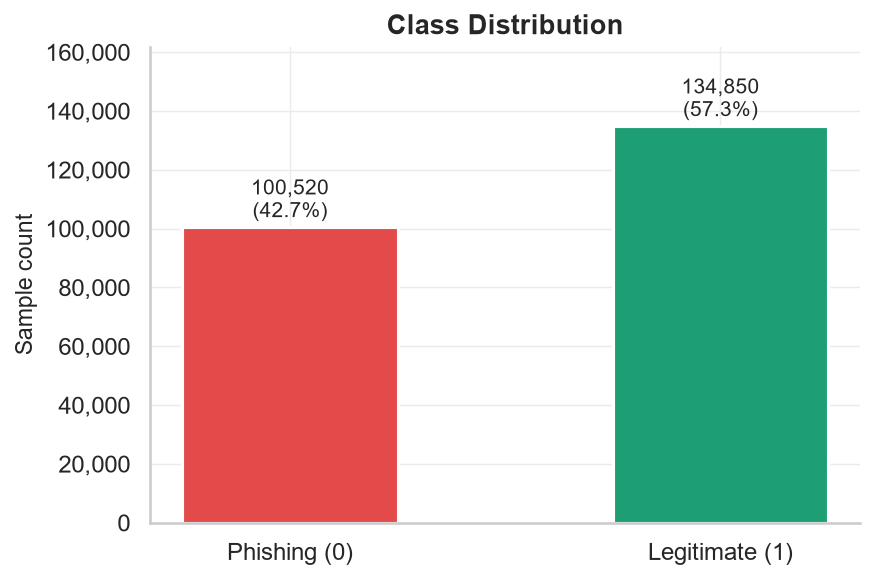

### Dataset Class Distribution

</div>

---

<div align="center">

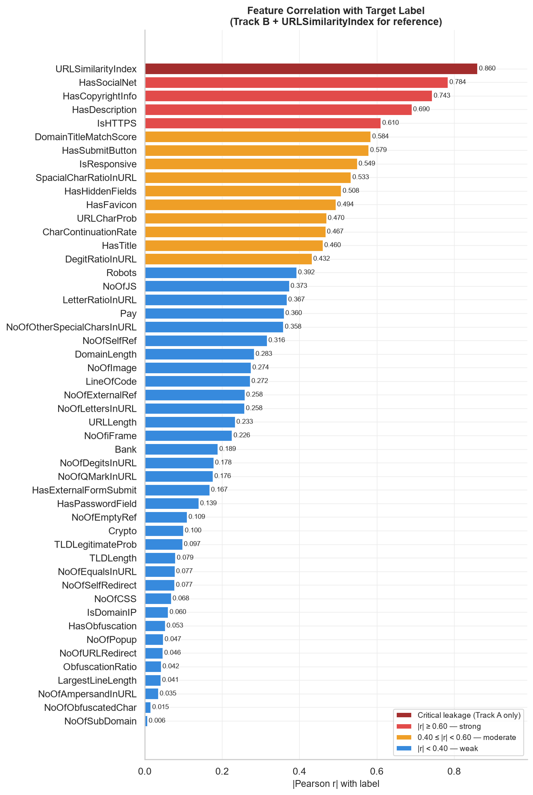

### Feature Correlation With Target

</div>

---

<div align="center">

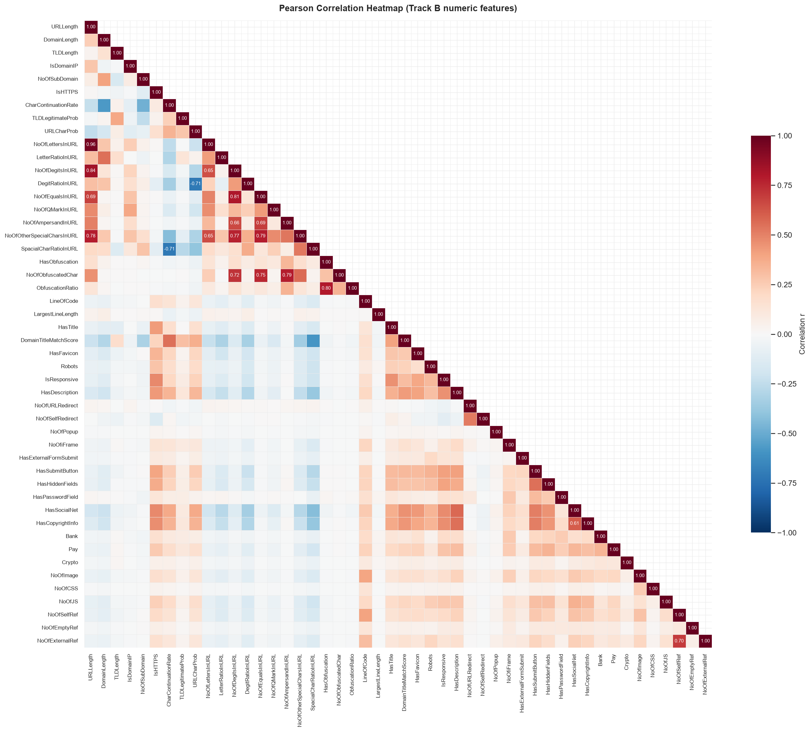

### Pearson Correlation Analysis

</div>

---

# 🔬 Leakage Investigation

One of the most important stages of this project involved identifying features capable of artificially inflating model performance.

<div align="center">

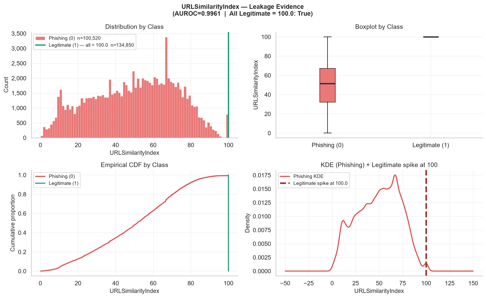

### URLSimilarityIndex Leakage Analysis

</div>

---

<div align="center">

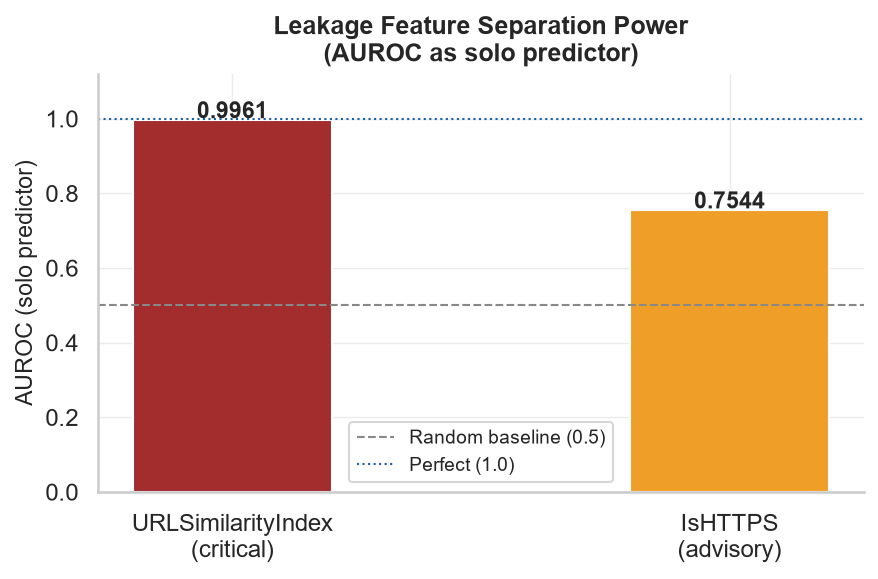

### Leakage Feature Performance Comparison

</div>

---

# 🤖 Machine Learning Models

The following models were trained and benchmarked:

| Model |
|---------|
| Logistic Regression |
| Random Forest |
| XGBoost |
| LightGBM |

---

<div align="center">

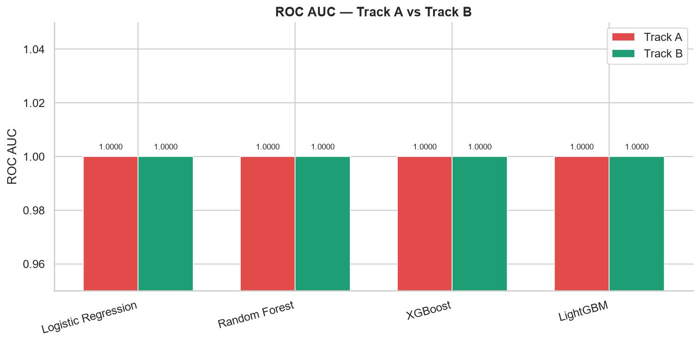

### ROC-AUC Benchmark

</div>

---

<div align="center">


### F1 Score Comparison

</div>

---

<div align="center">

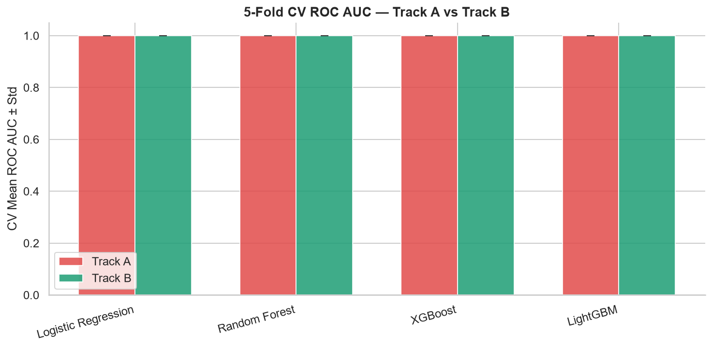

### Cross Validation Performance

</div>

---

# 🧠 Explainable AI

Instead of blindly trusting predictions, this project explains every decision.

---

<div align="center">

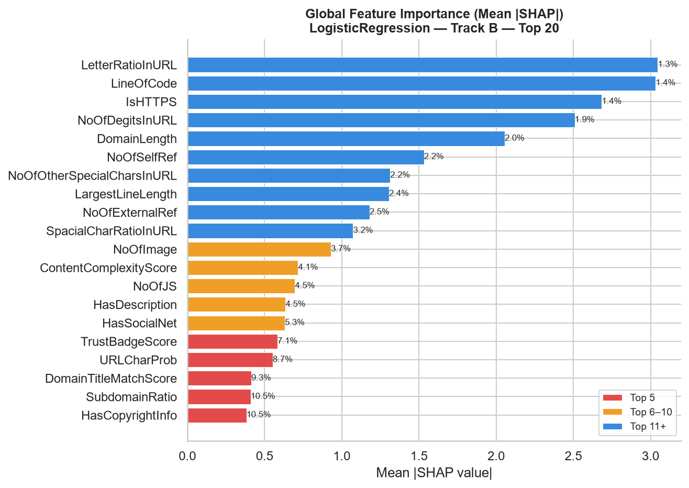

### Global Feature Importance (SHAP)

</div>

---

<div align="center">

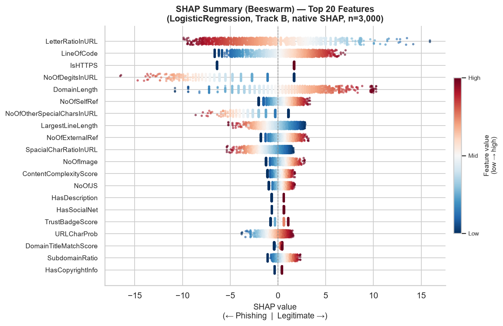

### SHAP Summary Analysis

</div>

---

<div align="center">

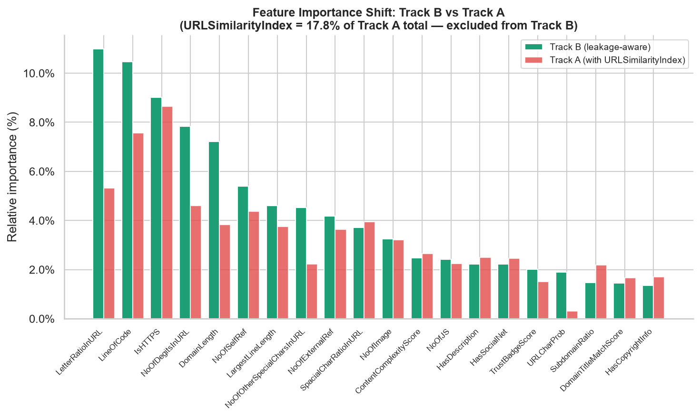

### Feature Importance Across Tracks

</div>

---

# 🔎 SHAP × LIME Validation

Interpretability itself should be validated.

To improve explanation reliability, SHAP and LIME explanations are compared across multiple prediction scenarios.

---

<div align="center">

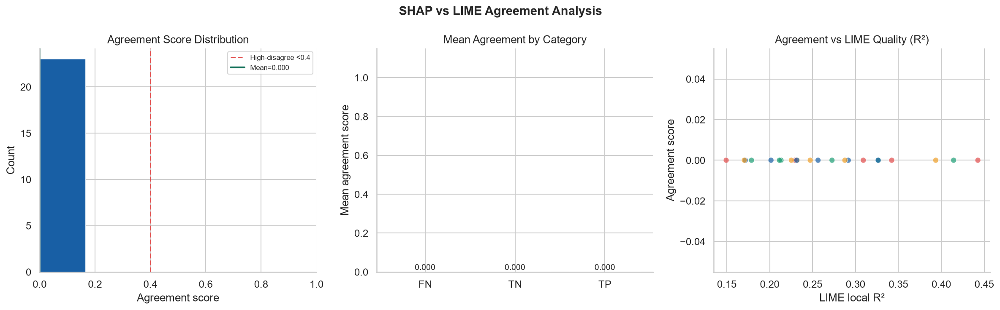

### SHAP–LIME Agreement Analysis

</div>

---

<div align="center">

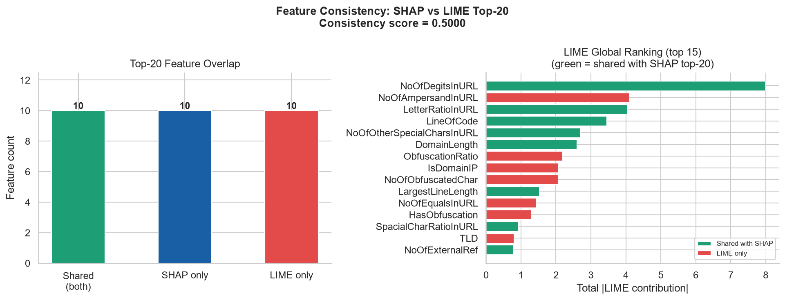

### Feature Consistency Analysis

</div>

---

# 🎯 Key Contributions

✔ End-to-End Phishing Detection Pipeline

✔ Explainable Artificial Intelligence Framework

✔ SHAP Global Interpretability

✔ LIME Local Interpretability

✔ Leakage Detection Analysis

✔ Bias & Fairness Evaluation

✔ Blind Spot Discovery

✔ Comparative Feature Engineering Study

✔ Trustworthy Cybersecurity Analytics

✔ Research-Oriented Security Intelligence Framework

---

# 👨‍💻 Contributors

## Hifza Amir

**B.Tech CSE (Data Science)**

Machine Learning • Data Science • Explainable AI • Analytics

GitHub: https://github.com/hiifza

---

## Shihan Ahmad

**B.Tech CSE (Cybersecurity)**

Cybersecurity • Threat Intelligence • Security Analytics

GitHub: https://github.com/ShihanG9

---

<div align="center">

# 🌟 Vision

To bridge the gap between Cybersecurity and Explainable Artificial Intelligence by developing security systems that are not only accurate but also transparent, interpretable, and trustworthy.

### Building Trustworthy AI for Cybersecurity

Machine Learning • Explainability • Fairness • Security Intelligence

⭐ Star this repository if you found it useful.

</div>
