<div align="center">

# 🛡️ Explainable & Bias-Aware Phishing Website Detection

### Using Interpretable Cybersecurity Analytics

<br>


<br>

### Building Transparent, Fair and Explainable Machine Learning Systems for Cybersecurity

</div>

---

# 📖 Overview

Modern phishing attacks increasingly mimic legitimate websites, making them difficult to detect using conventional security techniques. Although machine learning models achieve excellent predictive performance, they often provide little explanation for *why* a website is classified as phishing.

This project presents an **end-to-end cybersecurity intelligence framework** that combines high-performance phishing detection with **Explainable AI**, **Fairness Evaluation**, **Reliability Assessment**, and **Blind Spot Discovery**.

Rather than focusing solely on classification accuracy, the framework investigates how machine learning models make decisions, where they fail, and how reliable those decisions are, enabling transparent and trustworthy AI-assisted cybersecurity.

---

# ✨ At a Glance

| | |
|:--|:--|
| 📊 **Dataset** | **235,795** Website Samples |
| 🧩 **Features** | **56 Engineered Features** |
| 🤖 **Models** | Logistic Regression, Random Forest, XGBoost & LightGBM |
| 🏆 **Deployment Model** | **LightGBM (Track B)** |
| 🧠 **Explainability** | SHAP & LIME |
| ⚖️ **Trustworthiness** | Bias & Fairness Evaluation |
| 🚨 **Security Intelligence** | Blind Spot Discovery |

---

# 📈 Performance Snapshot

| Metric | Value |
|:----------------------------|:------------:|
| Dataset Size | **235,795** |
| Features | **56** |
| Models Evaluated | **4** |
| Best Accuracy | **99.99%+** |
| ROC–AUC | **1.00** |
| Deployment Model | **LightGBM (Track B)** |
| Fairness Status | ✅ PASS |
| Critical Blind Spots | **3** |

---

# 🖼️ Project Preview

<div align="center">

### Model Benchmark


<br><br>

### Dataset Distribution


</div>

---

# 🎯 Project Objectives

- Detect phishing websites using advanced machine learning techniques.
- Interpret model predictions using SHAP and LIME.
- Evaluate fairness across multiple website characteristics.
- Discover critical blind spots and high-risk prediction failures.
- Build an explainable and trustworthy cybersecurity intelligence framework.

---
# 🚀 Research Pipeline

The framework follows a modular pipeline that transforms raw phishing website data into actionable cybersecurity intelligence. Each stage contributes a specific capability, enabling not only accurate phishing detection but also transparent model interpretation, fairness evaluation, and reliability assessment.

---

<div align="center">

```text
                 PhiUSIIL Dataset
                        │
                        ▼
            Data Validation & Profiling
                        │
                        ▼
        Exploratory Data Analysis (EDA)
                        │
                        ▼
      Feature Engineering & Preprocessing
                        │
                        ▼
       Machine Learning Model Training
                        │
                        ▼
        Model Evaluation & Benchmarking
                        │
                        ▼
      SHAP Explainability Analysis
                        │
                        ▼
      LIME Local Interpretability
                        │
                        ▼
      Bias & Fairness Investigation
                        │
                        ▼
      Blind Spot Discovery & Reliability
                        │
                        ▼
      Cybersecurity Intelligence Reports
```

</div>

---

# 🔬 Framework Components

| Component | Purpose |
|-----------|---------|
| 📂 **Data Analysis** | Validated dataset quality, feature distributions, correlations, outliers, and potential leakage before training. |
| ⚙️ **Feature Engineering** | Processed 56 phishing-related website features and prepared two experimental datasets. |
| 🤖 **Model Development** | Trained and benchmarked Logistic Regression, Random Forest, XGBoost, and LightGBM. |
| 📈 **Performance Evaluation** | Compared models using Accuracy, Precision, Recall, F1-Score, ROC-AUC, Calibration, and Confusion Matrices. |
| 🧠 **Explainable AI** | Applied SHAP and LIME to understand both global model behaviour and individual predictions. |
| ⚖️ **Bias Analysis** | Evaluated prediction consistency across URL length, HTTPS, TLD, domain characteristics, and external resources. |
| 🚨 **Blind Spot Intelligence** | Investigated false negatives, recurring phishing archetypes, and prediction reliability. |

---

# 📊 Exploratory Data Analysis

Before model development, the dataset was carefully examined to understand statistical properties, feature relationships, and class behaviour.

<div align="center">

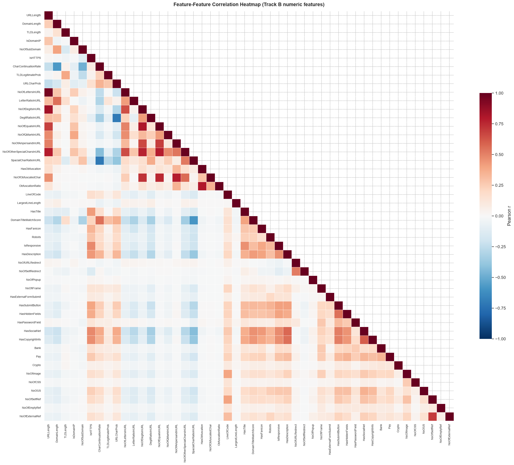

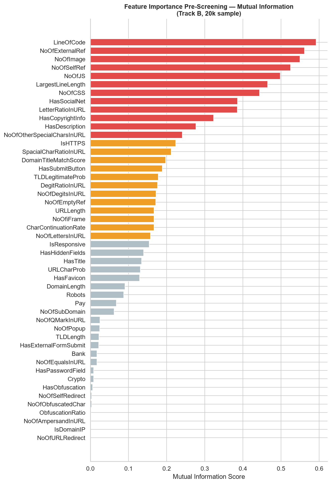

</div>

---

# 🏆 Model Benchmark

Four supervised learning algorithms were evaluated across two experimental tracks to identify the most reliable deployment model.

<div align="center">


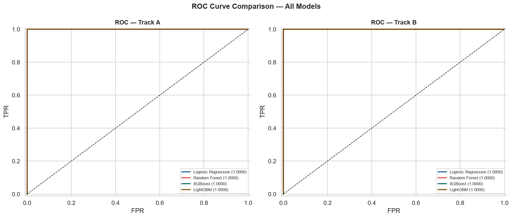

</div>

---

## 📌 Key Takeaways

- Comprehensive data validation ensured high-quality model inputs.
- Multiple machine learning algorithms were benchmarked under identical evaluation settings.
- Explainability, fairness, and reliability were integrated directly into the learning pipeline rather than treated as post-processing steps.
- The framework extends beyond phishing detection by providing actionable cybersecurity intelligence for model interpretation and risk analysis.

---
# 📊 Experimental Results & Explainable AI

The proposed framework was evaluated beyond conventional classification metrics to understand **why the model performs well**, **which features influence predictions**, and **how explanations differ across instances**. Explainability was integrated throughout the evaluation process to improve transparency and trustworthiness.

---

# 🏆 Model Performance

Four machine learning algorithms were benchmarked using multiple evaluation metrics. LightGBM (Track B) demonstrated the strongest balance between predictive performance, generalization, and deployment suitability.

<div align="center">


</div>

<br>

<div align="center">

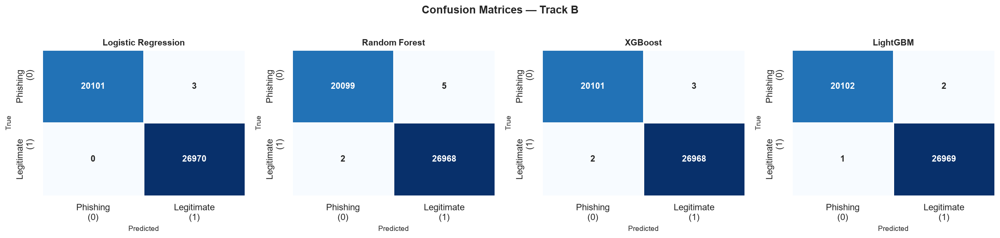

</div>

---

## 📈 Performance Summary

| Model | Accuracy | ROC-AUC | Status |
|:----------------------|:---------:|:-------:|:----------------|
| Logistic Regression | 99.99% | 1.00 | Excellent |
| Random Forest | 100.00% | 1.00 | Excellent |
| XGBoost | 99.99% | 1.00 | Excellent |
| **LightGBM** | **99.99%** | **1.00** | **Deployment Model** |

---

# 🧠 Global Explainability (SHAP)

SHAP was used to quantify the contribution of each feature towards phishing predictions, allowing the model's internal decision process to be interpreted globally.

<div align="center">


</div>

<br>

<div align="center">

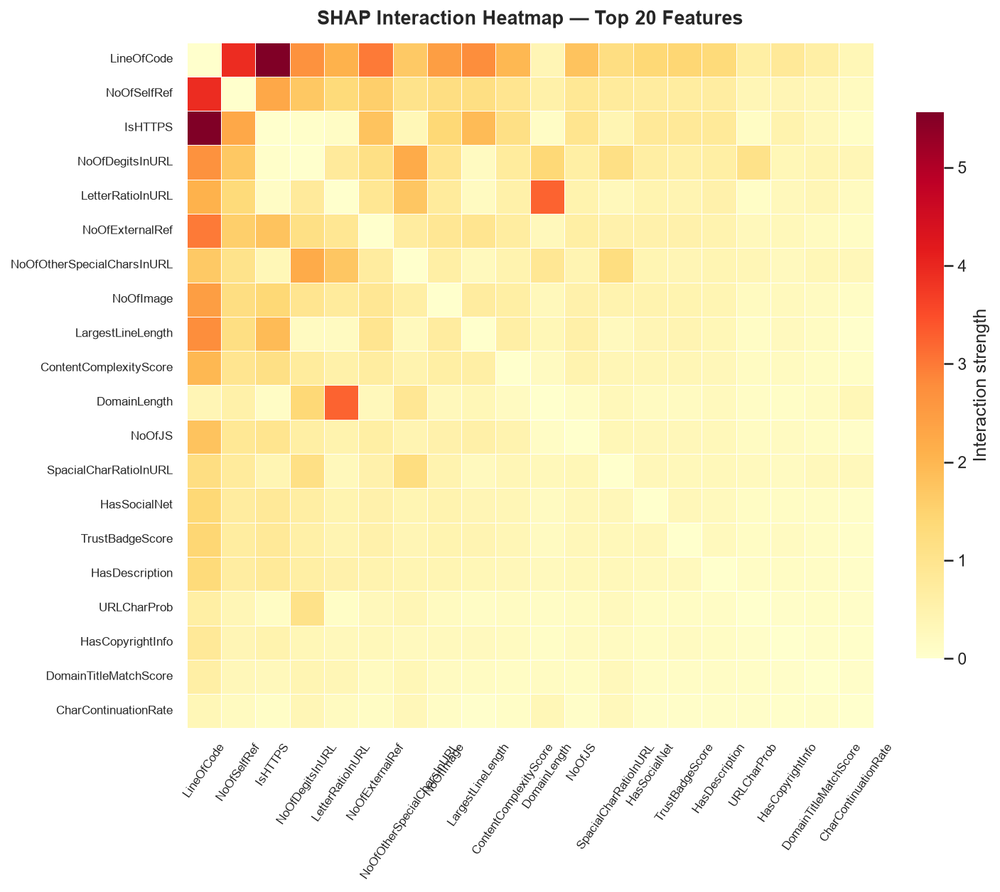

</div>

---

## 🔍 Major SHAP Findings

- **LetterRatioInURL** emerged as the most influential phishing indicator.
- URL composition features contributed more strongly than visual webpage characteristics.
- HTTPS status alone was insufficient to determine website legitimacy.
- Feature interaction analysis revealed hidden relationships between phishing indicators.

---

# 💡 Local Explainability (LIME)

While SHAP explains global model behaviour, LIME provides local explanations for individual predictions, enabling investigation of specific phishing and legitimate website classifications.

<div align="center">


</div>

---

## 📌 Explainability Insights

✔ Global feature importance identified the strongest phishing indicators.

✔ Local explanations revealed why individual websites were classified as phishing.

✔ SHAP and LIME complemented each other by providing both global and instance-level interpretability.

✔ Explainability transformed the model from a black-box classifier into an interpretable cybersecurity decision-support system.

---
# 🛡️ Trustworthiness, Fairness & Blind Spot Intelligence

A reliable cybersecurity system must do more than achieve high accuracy—it should make consistent, unbiased, and trustworthy predictions under diverse conditions. To evaluate the robustness of the proposed framework, extensive analyses were performed to measure fairness, investigate prediction failures, and assess model reliability.

---

# ⚖️ Fairness & Bias Analysis

The deployment model was evaluated across multiple website characteristics to determine whether predictive performance remained consistent for different data groups.

<div align="center">

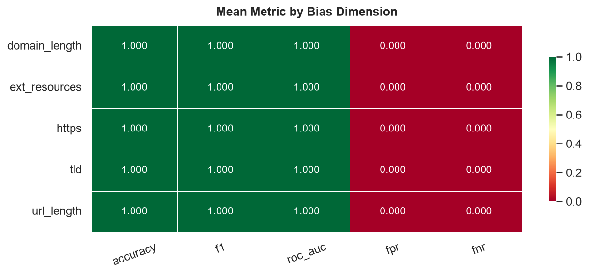

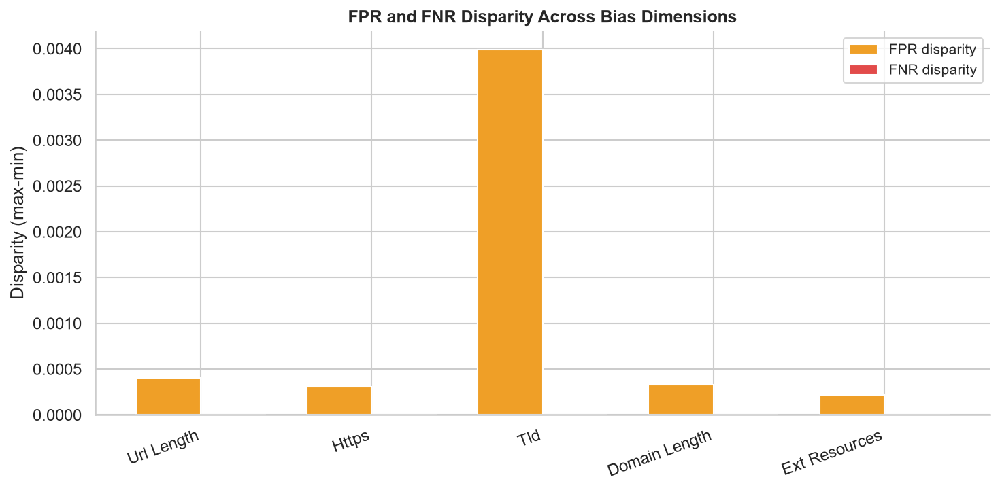

</div>

<br>

<div align="center">

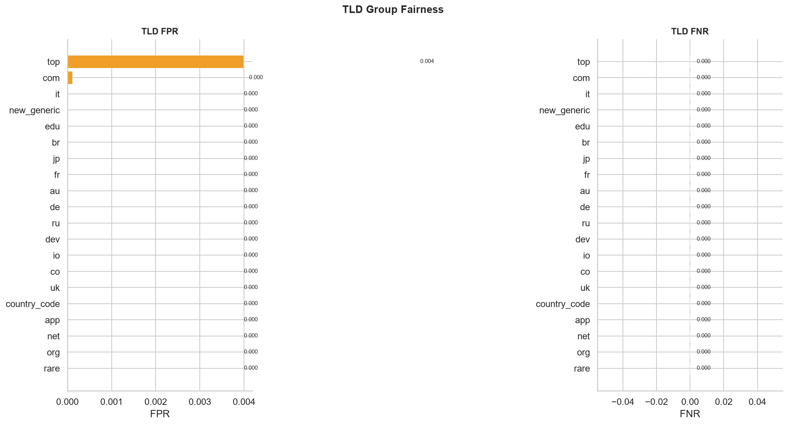

</div>

---

## 📊 Fairness Summary

| Evaluation Group | Result |
|:-----------------|:------:|
| URL Length | ✅ PASS |
| Domain Length | ✅ PASS |
| HTTPS Usage | ✅ PASS |
| Top-Level Domain | ✅ PASS |
| External Resources | ✅ PASS |

### Key Findings

- No statistically significant performance drift was observed across evaluated website groups.
- Prediction quality remained stable regardless of URL structure or website characteristics.
- The deployment model demonstrated strong fairness and consistent generalization.

---

# 🚨 Blind Spot Analysis

High-performing models can still fail on rare and difficult phishing websites. To better understand these failures, false negatives and challenging predictions were investigated using clustering, explanation analysis, and confidence evaluation.

<div align="center">

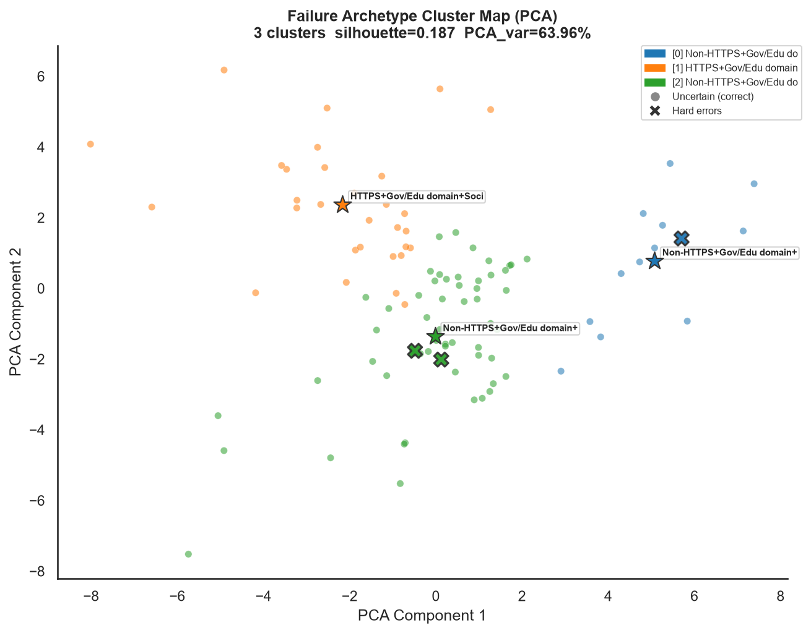

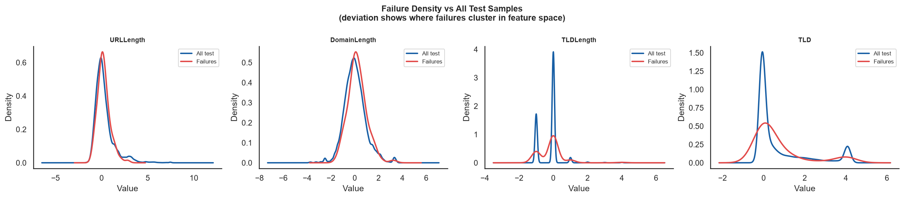

</div>

---

# 📈 Reliability Assessment

Prediction confidence was compared with explanation agreement to identify situations where highly confident predictions may still require human review.

<div align="center">

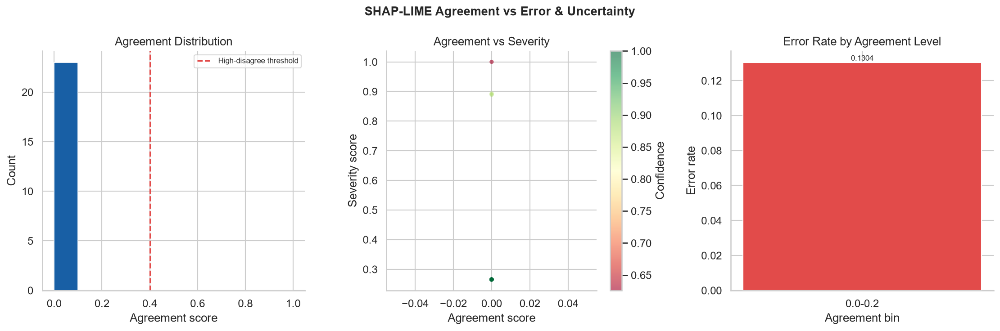

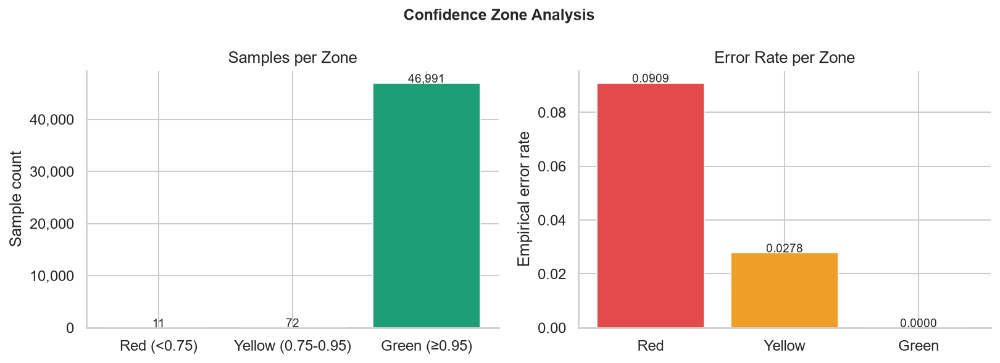

</div>

---
---

# 🌐 M11 – PhishGuard Intelligence Platform

The final phase of the project transforms the research pipeline into an interactive web-based intelligence platform. Instead of viewing results through notebooks or static reports, analysts can explore explainability, model performance, fairness, and blind spot investigations through a unified dashboard.

---

## 🚀 Platform Features

| Module | Description |
|---------|-------------|
| 📊 Executive Dashboard | Summarizes dataset statistics, model performance, fairness status, and deployment metrics. |
| 🧠 SHAP Intelligence | Interactive visualization of global feature importance and explainable model behaviour. |
| 💡 LIME Analysis | Local explanations for individual phishing predictions with feature-level interpretation. |
| ⚖️ Bias & Fairness | Performance comparison across multiple website characteristics to detect potential bias. |
| 🚨 Blind Spot Analysis | Investigation of critical false negatives, reliability zones, and failure archetypes. |
| 📈 Model Comparison | Comparative evaluation of Logistic Regression, Random Forest, XGBoost, and LightGBM. |
| 📂 Research Reports | Serves generated reports, plots, and CSV outputs directly from the research pipeline. |

---

## 🏗️ System Architecture

```text
React + Vite Frontend
          │
          ▼
 FastAPI REST API
          │
          ▼
 Research Outputs (M1–M10)
          │
          ├── CSV Reports
          ├── PNG Visualizations
          ├── HTML Reports
          └── Trained ML Models
```

---

## 🔌 Backend Intelligence APIs

The FastAPI backend exposes research outputs through REST endpoints, allowing the frontend to consume live data directly from the generated artifacts.

| Endpoint | Purpose |
|----------|---------|
| `/api/intelligence/shap` | SHAP feature importance |
| `/api/intelligence/lime` | LIME explanation summary |
| `/api/intelligence/models` | Model evaluation metrics |
| `/api/intelligence/bias` | Bias & fairness analysis |
| `/api/intelligence/blindspots` | Blind spot investigation |
| `/api/intelligence/reliability` | Reliability assessment |
| `/api/intelligence/dataset` | Dataset overview |
| `/api/intelligence/executive` | Executive dashboard metrics |

---

## 💻 Technology Stack

- **Frontend:** React, Vite
- **Backend:** FastAPI
- **Machine Learning:** Scikit-learn, LightGBM, XGBoost
- **Explainability:** SHAP, LIME
- **Data Processing:** Pandas, NumPy
- **Visualization:** Matplotlib
- **API Communication:** REST API (JSON)

---

> **M11 bridges research and deployment by converting the outputs of M1–M10 into an interactive cybersecurity intelligence platform, making model interpretation, fairness evaluation, and phishing analysis accessible through a modern web interface.**

---

# 🔬 Research Contributions

This framework extends traditional phishing detection by integrating multiple complementary research components into a single cybersecurity intelligence pipeline.

### ✔ Explainable AI

- Global explanations using SHAP
- Local explanations using LIME
- Feature interaction analysis

### ✔ Fairness Intelligence

- Multi-dimensional bias evaluation
- Group-wise performance comparison
- Robustness assessment

### ✔ Reliability Intelligence

- Confidence zone analysis
- Explanation agreement evaluation
- Prediction consistency measurement

### ✔ Blind Spot Intelligence

- Failure archetype discovery
- Critical false-negative investigation
- Reliability-based risk assessment

---

# 🎯 Key Outcomes

- 🏆 LightGBM (Track B) achieved the strongest deployment performance.
- 🧠 Explainable AI improved transparency of phishing predictions.
- ⚖️ Fairness analysis showed stable behaviour across evaluated groups.
- 🚨 Blind spot analysis revealed recurring high-risk phishing patterns.
- 📊 Reliability evaluation demonstrated the value of combining prediction confidence with explanation agreement.
- 🔍 The framework provides interpretable cybersecurity intelligence beyond conventional machine learning classification.

---

# 👥 Contributors

| | |
|:--:|:--:|
| **Hifza Amir** | **Shihan Ahmad** |
| B.Tech CSE (Data Science) | B.Tech CSE (Cybersecurity) |
| Machine Learning • Explainable AI • Bias Analysis • Documentation | Cybersecurity Research • Model Development • Validation |

---

<div align="center">

### ⭐ If you found this project interesting, consider giving it a Star.

**Built using Machine Learning, Explainable AI, and Cybersecurity Analytics.**

</div>
